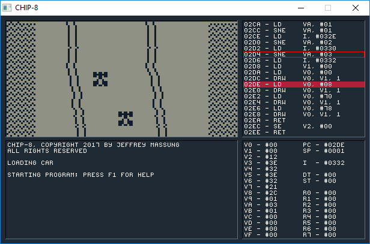

# CHIP-8 Emulator



CHIP-8 is an assembler, debugger, and emulator for the [COSMAC ELF][2] [CHIP-8][3] interpreter and its derivative: the Super CHIP-8, which ran on HP-48 calculators. Everything is emulated as well as possible: the video display refreshes at 60 Hz and sound is emulated as well.

From the screenshot above you can see the disassembled program, register values, and a log which is used to show breakpoint information, memory dumps, and more.

CHIP-8 is written in [Go](https://golang.org/) and uses [SDL](https://www.libsdl.org/) for its rendering, input handling, and audio. It should easily run on Windows, OS X, and Linux.

## Usage

```
CHIP-8 [-b] [ROM|C8]
```

Simply pass the filename of the ROM or a .C8 assembly source file to the executable and CHIP-8 will load it, assemble if required, and begin running it. If no ROM or C8 file is specified then a default ROM ([Pong](https://en.wikipedia.org/wiki/Pong)) is loaded. 

Once the program is running, press `H` at any time to see the list of key commands available to you. But here's a quick breakdown:

| Emulation         | Description
|:------------------|:-----------------
| `Back`            | Reset the emulator
| `Ctrl`+`Back`     | Reset and break
| `[`               | Decrease emulation speed
| `]`               | Increase emulation speed
| `F3`              | Load ROM or C8 assembler file

| Debugging         | Description
|:------------------|:-----------------
| `F5`              | Pause/break emulation
| `F6`              | Single step
| `F7`              | Step over
| `F8`              | Dump memory at `I` register
| `F9`              | Toggle breakpoint

### Virtual Key Mapping

The original CHIP-8 had 16 virtual keys had the layout on the left, which has been mapped (by default) to the keyboard layout on the right:

```
 1 2 3 C                                   1 2 3 4
 4 5 6 D    This is emulated with these    Q W E R
 7 8 9 E    keyboard keys -->              A S D F
 A 0 B F                                   Z X C V
```

## The Assembler

While playing the games that exist for the CHIP-8 might be fun for a while, the real fun is in creating your own games and seeing just how creative you can be with such a limited machine!

Just about every assembler for the CHIP-8 is different, and this one is, too. It's designed with a few niceties in mind. So, bear this in mind and take a few minutes to peruse this documentation.

A heavily documented, example program for the game [Snake](https://en.wikipedia.org/wiki/Snake_(video_game)) can be found in [games/sources/snake.c8](https://github.com/massung/chip-8/blob/master/games/sources/snake.c8).

### Syntax

Each line of assembly uses the following syntax:

```
.label    instruction  arg0, arg1, ...   ; comment
```

A label **must** appear at the very beginning of the line, and there **must** be at least a single whitespace character before the instruction or directive of a line (i.e. an instruction cannot appear at the beginning of a line).

### Registers

The CHIP-8 has 16, 8-bit virtual registers: `V0`, `V1`, `V2`, `V3`, `V4`, `V5`, `V6`, `V7`, `V8`, `V9`, `VA`, `VB`, `VC`, `VD`, `VE`, and `VF`. All of these are considered general purpose registers except for `VF` which is used for carry, borrow, shift, overflow, and collision detection.
 
There is a single, 16-bit address register: `I`, which is used for reading from - and writing to - memory.

Last, there are two, 8-bit, timer registers (`DT` for delays and `ST` for sounds) that continuously count down at 60 Hz. The delay timer is good for time limiting your game or waiting brief periods of time. While the sound timer is non-zero a tone will be emitted.

Finally, the Super CHIP-8, which was used on the HP-48 calculators, contained 8, 8-bit, user-flag registers: `R0`-`R7`. These cannot be directly used, but registers `V0`-`V7` can be saved to - and loaded from - them. This can be quite handy at times. See the `LD R, VX` and `LD VX, R` instructions below.

### Literals

Literal constants can be in decimal, hexadecimal, or binary. Only decimal values can be negative, and binary allows the use of `.` in place of `0` to make it easier to visualize sprites.

```
    LD      V0, #FF
    ADD     V0, -2
    
.ball
    BYTE    $..1111..
    BYTE    $.1....1.
    BYTE    $1......1
    BYTE    $1......1
    BYTE    $.1....1.
    BYTE    $..1111..
```

Text literals can be added with single or double quotes, but there is no escape character. Usually this is just to add text information to the final ROM.

```
    BYTE    "A little game made by ME!"
```

### Instruction Set

While this information is readily available in a few other places, I'm adding it here so it isn't lost. There are also a few tid-bits here that I couldn't find anywhere else.

Each instruction is 16-bit and written MSB first. Each instruction is broken down into nibbles, where the nibbles (when combined) mean the following:

| Operand | Description
|:--------|:-----------
| X       | Virtual register (V0-VF)
| Y       | Virtual register (V0-VF)
| N       | 4-bit nibble literal
| NN      | 8-bit byte literal
| NNN     | 12-bit literal address (typically a label)

Here is the CHIP-8 instructions. The Super CHIP-8 instructions follow after the basic instruction set.

| Opcode | Mnemonic      | Description
|:-------|:--------------|:---------------------------------------------------------------
| 00E0   | CLS           | Clear video memory
| 00EE   | RET           | Return from subroutine
| 0NNN   | SYS NNN       | Call CDP1802 subroutine at NNN
| 1NNN   | CALL NNN      | Call CHIP-8 subroutine at NNN
| 2NNN   | JP NNN        | Jump to address NNN
| BNNN   | JP V0, NNN    | Jump to address NNN + V0
| 3XNN   | SE VX, NN     | Skip next instruction if VX == NN
| 4XNN   | SNE VX, NN    | Skip next instruction if VX != NN
| 5XY0   | SE VX, VY     | Skip next instruction if VX == VY
| 9XY0   | SNE VX, VY    | Skip next instruction if VX != VY
| EX9E   | SKP VX        | Skip next instruction if key(VX) is pressed
| EXA1   | SKNP VX       | Skip next instruction if key(VX) is not pressed
| FX0A   | LD VX, K      | Wait for key press, store key pressed in VX
| 6XNN   | LD VX, NN     | VX = NN
| 8XY0   | LD VX, VY     | VX = VY
| FX07   | LD VX, DT     | VX = DT
| FX15   | LD DT, VX     | DT = VX
| FX18   | LD ST, VX     | ST = VX
| ANNN   | LD I, NNN     | I = NNN
| FX29   | LD F, VX      | I = address of 4x5 font character in VX (0..F) (* see note)
| FX33   | LD B, VX      | Store BCD representation of VX at I (100), I+1 (10), and I+2 (1); I remains unchanged
| FX55   | LD [I], VX    | Store V0..VX (inclusive) to memory starting at I; I remains unchanged
| FX65   | LD VX, [I]    | Load V0..VX (inclusive) from memory starting at I; I remains unchanged
| FX1E   | ADD I, VX     | I = I + VX; VF = if I > 0xFFF then 1 else 0
| 7XNN   | ADD VX, NN    | VX = VX + NN
| 8XY4   | ADD VX, VY    | VX = VX + VY; VF = if carry then 1 else 0
| 8XY5   | SUB VX, VY    | VX = VX - VY; VF = if not borrow then 1 else 0
| 8XY7   | SUBN VX, VY   | VX = VY - VX; VF = if not borrow then 1 else 0
| 8XY1   | OR VX, VY     | VX = VX OR VY
| 8XY2   | AND VX, VY    | VX = VX AND VY
| 8XY3   | XOR VX, VY    | VX = VX XOR VY
| 8XY6   | SHR VX        | VF = LSB(VX); VX = VX >> 1 (** see note)
| 8XYE   | SHL VX        | VF = MSB(VX); VX = VX << 1 (** see note)
| CXNN   | RND VX, NN    | VX = RND() AND NN
| DXYN   | DRW VX, VY, N | Draw 8xN sprite at I to VX, VY; VF = if collision then 1 else 0

And here are the instructions added for the Super CHIP-8 (a.k.a. CHIP-48):

| Opcode | Mnemonic      | Description
|:-------|:--------------|:---------------------------------------------------------------
| 00BN   | SCU N         | Scroll up N pixels (N/2 pixels in low res mode)
| 00CN   | SCD N         | Scroll down N pixels (N/2 pixels in low res mode)
| 00FB   | SCR           | Scroll right 4 pixels (2 pixels in low res mode)
| 00FC   | SCL           | Scroll left 4 pixels (2 pixels in low res mode)
| 00FD   | EXIT          | Exit the interpreter; this causes the VM to infinite loop
| 00FE   | LOW           | Enter low resolution (64x32) mode; this is the default mode
| 00FF   | HIGH          | Enter high resolution (128x64) mode
| DXY0   | DRW VX, VY, 0 | Draw a 16x16 sprite at I to VX, VY (8x16 in low res mode) (*** see note)
| FX30   | LD HF, VX     | I = address of 8x10 font character in VX (0..F) (* see note)
| FX75   | LD R, VX      | Store V0..VX (inclusive) into HP-RPL user flags R0..RX (X < 8)
| FX85   | LD VX, R      | Load V0..VX (inclusive) from HP-RPL user flags R0..RX (X < 8)

Nothing special needs to be done to use the Super CHIP-8 instructions. They are just noted separately for anyone wishing to hack the code, so they are aware that they are not part of the original CHIP-8 virtual machine.

_(\*): This is implementation-dependent. Originally the CDP1802 CHIP-8 interpreter kept this memory somewhere else, but most emulators (including this one) put these sprites in the first 512 bytes of the program._

_(\*\*): So, in the original CHIP-8, the shift opcodes were actually intended to be `VX = VY shift 1`. But somewhere along the way this was dropped and shortened to just be `VX = VX shift 1`. No ROMS or emulators I could find implemented the original CHIP-8 shift instructions, and so neither does this one. However, the assembler will always write out a correct instruction so that any future emulators can implement the shift either way and it will work._

_(\*\*\*): When implementing 16x16 sprite drawing, note that the sprites are drawn row major. The frist two bytes make up the first row, the next two bytes the second row, etc._

### Directives

The assembler understands - beyond instructions - the following directives:

| Directive          | Description
|:-------------------|:-------------------
| `ID EQU ..`        | Declare an identifier that to equal a literal constant, register, or label. Must be declared before being used.
| `BREAK ..`         | Create a breakpoint. No instruction is written, but the emulator will break before the next instruction is executed.
| `ASSERT ..`        | Create a conditional breakpoint. The emulator will only break if `VF` is non-zero when the assert is hit. 
| `BYTE ..`          | Write bytes to the ROM. This can take bytes literals or text strings.
| `WORD ..`          | Write 2-byte words to the ROM in MSB first byte order.
| `ALIGN BOUNDARY`   | Align the ROM to a power of 2 byte boundary.
| `RESERVE N`        | Write N zero-bytes to the ROM.

## Debugging

If `-b` is passed as a command line flag, then the CHIP-8 emulator will start with a breakpoint at the first address executed. This behavior can also be accomplished by rebooting the CHIP-8 emulator (by pressing `BACK`) while holding the `CTRL` key.

While the program is running, pressing `F5` or `SPACE` will pause emulation and break into the debugger. You should see the disassembled code with the current instruction highlighted red.

Once in the debugger, pressing `F6` will single-step the current instruction and `F7` will step "over" it (this is useful when on a `CALL` instruction and you'd rather just skip the call and break again once you've returned back). Press `F8` to dump the memory near the `I` register. `F9` will toggle a breakpoint on the current instruction.

When you've gotten whatever information you need, press `F5` again to continue execution.

If you are debugging your own C8 assembler program, don't forget about the `BREAK` and `ASSERT` directives.

_NOTE: the `DT` and `ST` registers still count down even while emulation is paused/broken. This is so the sound tone isn't constantly on while debugging and a delay would take a long time to reach zero if single stepping._

## CHIP-8 Tips & Tricks

Assembly language - if you're not used to it - can be a bit daunting at first. Here's some tips to keep in mind (for CHIP-8 and assembly programming in general) that can help you along the way...

* If you want to subtract a constant value from a register, remember it's easier to just add a negative value instead.

* Want to compare greater or less than? Use `SUB` and `SUBN`. Remember `VF` is 1 if there is **not** a borrow (read: the result is >= 0). Use `SUBN` when you want to compare, but not store the result in what you're comparing.

* Need a switch statement? Use `SE` and `SNE` followed by `JP` instructions to build a jump table. Use a `JP V0, address` instead when possible.

* Perform [tail calls](https://en.wikipedia.org/wiki/Tail_call) whenever possible. If you see a `CALL` followed by a `RET`, just change the `CALL` to a `JP` and get rid of the `RET`.

* Need a random point on the screen? `RND VX, #3F` for X and `RND VY, #1F` for Y. Use `#7F` and `#3F` if in high res mode.

* When setting up global use of registers, leave `V0`-`V2` always free as scratch. Most memory reads/writes use them, especially after performing a `LD` to BCD.

## Example CHIP-8 Programs

There are a few example programs in `games/sources` for you you play around with, modify, and learn from.

## That's all folks!

If you have any feedback, please email me. If you find a bug or would like a feature, feel free to open an issue. 

[1]: http://www.cosmacelf.com/
[2]: https://en.wikipedia.org/wiki/RCA_1802
[3]: https://en.wikipedia.org/wiki/CHIP-8/
