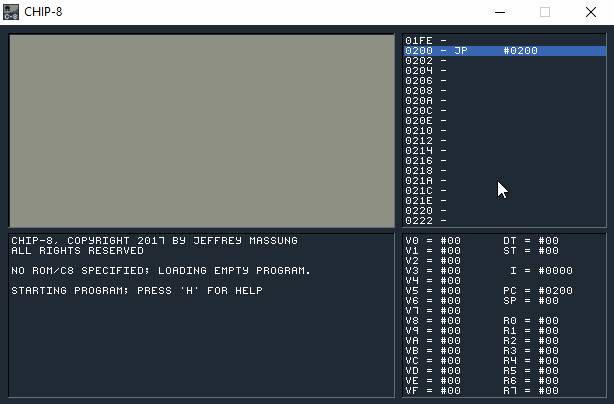

# CHIP-8 Emulator



CHIP-8 is an assembler, debugger, and emulator for the [COSMAC ELF][2] [CHIP-8][3] interpreter and its derivative: the Super CHIP-8, which ran on HP-48 calculators. Everything is emulated as well as possible: the video display refreshes at 60 Hz and sound is emulated as well.

From the screen capture above you can see the disassembled program, register values, and a log which is used to show breakpoint information, memory dumps, and more.

CHIP-8 is written in [Go](https://golang.org/) and uses [SDL](https://www.libsdl.org/) for its rendering, input handling, and audio. It should easily run on Windows, OS X, and Linux. It - and the source code - are under the [ZLIB license](https://en.wikipedia.org/wiki/Zlib_License).

## Downloading

You can download the latest pre-built release for your platform [here](https://github.com/massung/CHIP-8/releases).

## Building

If you'd like to build yourself, then you'll need the [go-sdl2](https://godoc.org/github.com/veandco/go-sdl2/sdl) package (which requires [cgo](https://golang.org/cmd/cgo/) to build). But, once you have that it should be as simple as running:

```
$ go build -ldflags "-H windowsgui"
```

If you'd like a nice application icon for Windows, then grab [akavel/rsrc](https://github.com/akavel/rsrc) and build the `syso` file for your architecture and then build:

```
$ rsrc -arch [386|amd64] -ico chip-8.ico -o chip-8.syso
Icon  chip-8.ico  ID:  4

$ go build -ldflags "-H windowsgui"
```

That's it. You should have a `chip-8` executable ready to run.

## Usage

Simply launch the app and away you go!
 
If you get a panic on startup or the application fails to launch for an unknown reason, it's most likely due to one of the following:

* `SDL2.DLL` is missing (or not installed).
* `FONT.BMP` is missing.

Once launched simply drag a ROM or C8 source file into the app to load it. You can also press `H` at any time to see the list of key commands available to you. But here's a quick breakdown:

| Emulation         | Description
|:------------------|:-----------------
| `Back`            | Reset the emulator
| `Ctrl`+`Back`     | Reset and break
| `[`               | Decrease emulation speed
| `]`               | Increase emulation speed
| `F2`              | Reload ROM or C8 assembler file
| `F3`              | Open ROM or C8 assembler file
| `F4`              | Save ROM

| Debugging         | Description
|:------------------|:-----------------
| `F5`              | Pause/break emulation
| `F6`              | Step over
| `F7`              | Step into
| `SHIFT`+`F7`      | Step out
| `F8`              | Dump memory at `I` register
| `F9`              | Toggle breakpoint

_Note: You can launch the emulator with `-eti`. This will tell the emulator to assemble and load ROMs in a mode that supports the ETI-660. This flag should be rarely used. The ETI-660 loads CHIP-8 programs starting at address 0x600 instead of 0x200. Use this if you intend to assemble and run a ROM on actual ETI-660 hardware or if you have a ROM assembled for the ETI (good luck finding one!)._

### Virtual Key Mapping

The original CHIP-8 had 16 virtual keys had the layout on the left, which has been mapped (by default) to the keyboard layout on the right:

```
 1 2 3 C                                   1 2 3 4
 4 5 6 D    This is emulated with these    Q W E R
 7 8 9 E    keyboard keys -->              A S D F
 A 0 B F                                   Z X C V
```

## The Assembler

While playing the games that exist for the CHIP-8 might be fun for a while, the real fun is in creating your own games and seeing just how creative you can be with such a limited machine!

Just about every assembler for the CHIP-8 is different, and this one is, too. It's designed with a few niceties in mind. So, bear this in mind and take a few minutes to peruse this documentation.

Heavily documented, example programs can be found in [games/sources/](https://github.com/massung/CHIP-8/tree/master/games/sources).

### Syntax

Each line of assembly uses the following syntax:

```
label instruction arg0, arg1, ... ; comment
```

A label **must** appear at the very beginning of the line, and there **must** be at least a single whitespace character before the instruction or directive of a line (i.e. an instruction cannot appear at the beginning of a line). There are plenty of examples in `games/sources` to learn from.

### Registers

The CHIP-8 has 16, 8-bit virtual registers: `V0`, `V1`, `V2`, `V3`, `V4`, `V5`, `V6`, `V7`, `V8`, `V9`, `VA`, `VB`, `VC`, `VD`, `VE`, and `VF`. All of these are considered general purpose registers except for `VF` which is used for carry, borrow, shift, overflow, and collision detection.
 
There is a single, 16-bit address register: `I`, which is used for reading from - and writing to - memory.

Last, there are two, 8-bit, timer registers (`DT` for delays and `ST` for sounds) that continuously count down at 60 Hz. The delay timer is good for time limiting your game or waiting brief periods of time. While the sound timer is non-zero a tone will be emitted.

Finally, the Super CHIP-8, which was used on the HP-48 calculators, contained 8, 8-bit, user-flag registers: `R0`-`R7`. These cannot be directly used, but registers `V0`-`V7` can be saved to - and loaded from - them. This can be quite handy at times. See the `LD R, VX` and `LD VX, R` instructions below.

### Literals

Literal constants can be in decimal, hexadecimal, or binary. Only decimal values can be negative, and binary allows the use of `.` in place of `0` to make it easier to visualize sprites.

```
        LD      V0, #FF
        ADD     V0, -2

BALL    BYTE    %.1......
        BYTE    %111.....
        BYTE    %.1......
```

Text literals can be added with single-, double-, or back-quotes, but there is no escape character. Usually this is just to add text information to the final ROM.

```
        BYTE    "A little game made by ME!"
```

### Instruction Set

While this information is readily available in a few other places, I'm adding it here so it isn't lost. There are also a few tid-bits here that I couldn't find anywhere else.

Each instruction is 16-bit and written MSB first. Each instruction is broken down into nibbles, where the nibbles (when combined) mean the following:

| Operand | Description
|:--------|:-----------
| X       | Virtual register (V0-VF)
| Y       | Virtual register (V0-VF)
| N       | 4-bit nibble literal
| NN      | 8-bit byte literal
| NNN     | 12-bit literal address (typically a label)

Here is the CHIP-8 instructions. The Super CHIP-8 instructions follow after the basic instruction set.

| Opcode | Mnemonic      | Description
|:-------|:--------------|:---------------------------------------------------------------
| 00E0   | CLS           | Clear video memory
| 00EE   | RET           | Return from subroutine
| 0NNN   | SYS NNN       | Call CDP1802 subroutine at NNN
| 1NNN   | CALL NNN      | Call CHIP-8 subroutine at NNN
| 2NNN   | JP NNN        | Jump to address NNN
| BNNN   | JP V0, NNN    | Jump to address NNN + V0
| 3XNN   | SE VX, NN     | Skip next instruction if VX == NN
| 4XNN   | SNE VX, NN    | Skip next instruction if VX != NN
| 5XY0   | SE VX, VY     | Skip next instruction if VX == VY
| 9XY0   | SNE VX, VY    | Skip next instruction if VX != VY
| EX9E   | SKP VX        | Skip next instruction if key(VX) is pressed
| EXA1   | SKNP VX       | Skip next instruction if key(VX) is not pressed
| FX0A   | LD VX, K      | Wait for key press, store key pressed in VX
| 6XNN   | LD VX, NN     | VX = NN
| 8XY0   | LD VX, VY     | VX = VY
| FX07   | LD VX, DT     | VX = DT
| FX15   | LD DT, VX     | DT = VX
| FX18   | LD ST, VX     | ST = VX
| ANNN   | LD I, NNN     | I = NNN
| FX29   | LD F, VX      | I = address of 4x5 font character in VX (0..F) (* see note)
| FX55   | LD [I], VX    | Store V0..VX (inclusive) to memory starting at I; I remains unchanged
| FX65   | LD VX, [I]    | Load V0..VX (inclusive) from memory starting at I; I remains unchanged
| FX1E   | ADD I, VX     | I = I + VX; VF = 1 if I > 0xFFF else 0
| 7XNN   | ADD VX, NN    | VX = VX + NN
| 8XY4   | ADD VX, VY    | VX = VX + VY; VF = 1 if overflow else 0
| 8XY5   | SUB VX, VY    | VX = VX - VY; VF = 1 if not borrow else 0
| 8XY7   | SUBN VX, VY   | VX = VY - VX; VF = 1 if not borrow else 0
| 8XY1   | OR VX, VY     | VX = VX OR VY
| 8XY2   | AND VX, VY    | VX = VX AND VY
| 8XY3   | XOR VX, VY    | VX = VX XOR VY
| 8XY6   | SHR VX        | VF = LSB(VX); VX = VX >> 1 (** see note)
| 8XYE   | SHL VX        | VF = MSB(VX); VX = VX << 1 (** see note)
| FX33   | BCD VX        | Store BCD representation of VX at I (100), I+1 (10), and I+2 (1); I remains unchanged
| CXNN   | RND VX, NN    | VX = RND() AND NN
| DXYN   | DRW VX, VY, N | Draw 8xN sprite at I to VX, VY; VF = 1 if collision else 0

And here are the instructions added for the Super CHIP-8 (a.k.a. SCHIP-8/CHIP-48):

| Opcode | Mnemonic      | Description
|:-------|:--------------|:---------------------------------------------------------------
| 00BN   | SCU N         | Scroll up N pixels (N/2 pixels in low res mode)
| 00CN   | SCD N         | Scroll down N pixels (N/2 pixels in low res mode)
| 00FB   | SCR           | Scroll right 4 pixels (2 pixels in low res mode)
| 00FC   | SCL           | Scroll left 4 pixels (2 pixels in low res mode)
| 00FD   | EXIT          | Exit the interpreter; this causes the VM to infinite loop
| 00FE   | LOW           | Enter low resolution (64x32) mode; this is the default mode
| 00FF   | HIGH          | Enter high resolution (128x64) mode
| DXY0   | DRW VX, VY, 0 | Draw a 16x16 sprite at I to VX, VY (8x16 in low res mode) (*** see note)
| FX30   | LD HF, VX     | I = address of 8x10 font character in VX (0..F) (* see note)
| FX75   | LD R, VX      | Store V0..VX (inclusive) into HP-RPL user flags R0..RX (X < 8)
| FX85   | LD VX, R      | Load V0..VX (inclusive) from HP-RPL user flags R0..RX (X < 8)

To use the above instructions, they need to be enabled with the `SUPER` directive.

In addition to the regular CHIP-8 and CHIP-48 instructions, there was also an extended instruction set (the CHIP-8E) added in 1979 by Paul Moews. These are very nice to have, and not used in any ROMs that I've seen online. However, this assembler supports them if turned on using the `EXTENDED` directive.

Using the `EXTENDED` instruction set will likely ensure that your ROM will not work with any other CHIP-8 emulator on actual hardware. And, *technically*, the `SUPER` and `EXTENDED` directives *should* be mutually exclusive as there is no hardware that supports both of them (the CHIP-48 was exclusively for HP-48 calculators and CHIP-8E was a one-off change to the CFP1802 interpreter for a few games). But, this assembler allows you to use both and the emulator does't care either.

| Opcode | Mnemonic      | Description
|:-------|:--------------|:---------------------------------------------------------------
| 5XY1   | SGT VX, VY    | Skip next instruction if VX > VY
| 5XY2   | SLT VX, VY    | Skip next instruction if VX < VY
| 9XY1   | MUL VX, VY    | VX * VY; VF contains the most significant byte, VX contains the least significant
| 9XY2   | DIV VX, VY    | VX / VY; VF contains the remainder
| 9XY3   | BCD VX, VY    | Store BCD representation of the 16-bit word VX, VY (where VX is the most significant byte) at I through I+4; I remains unchanged
| FX94   | LD A, VX      | Load I with the font sprite of the 6-bit ASCII value found in VX; V0 is set to the symbol length

It should be noted that the CHIP-8E also had a `DISP` instruction which output the value of `VX` to the hex display. That instruction is **not** supported, because the opcode is the same as a CHIP-48 instruction, and it is redundant as this app contains a debugger and all registers are visible at all times.

_(\*): This is implementation-dependent. Originally the CDP1802 CHIP-8 interpreter kept this memory somewhere else, but most emulators (including this one) put these sprites in the first 512 bytes of the program._

_(\*\*): So, in the original CHIP-8, the shift opcodes were actually intended to be `VX = VY shift 1`. But somewhere along the way this was dropped and shortened to just be `VX = VX shift 1`. No ROMS or emulators I could find implemented the original CHIP-8 shift instructions, and so neither does this one. However, the assembler will always write out a correct instruction so that any future emulators can implement the shift either way and it will work._

_(\*\*\*): When implementing 16x16 sprite drawing, note that the sprites are drawn row major. The first two bytes make up the first row, the next two bytes the second row, etc._

### Directives

The assembler understands - beyond instructions - the following directives:

| Directive    | Description
|:-------------|:-------------------
| `SUPER`      | The assembler will allow the use of CHIP-48 instructions.
| `EXTENDED`   | The assembler will allow the use of CHIP-8E instructions
| `EQU`        | Declare the label to equal a literal constant instead of the current address. Must be declared before being used.
| `VAR`        | Declare the label to represent a general purpose, V-register instead of the current address. Must be declared before being used.
| `BREAK`      | Create a breakpoint. No instruction is written, but the emulator will break before the next instruction is executed. All text after the directive will be output to the log.
| `ASSERT`     | Create a conditional breakpoint. The emulator will only break if `VF` is non-zero when the assert is hit. All text after the directive will be output to the log.
| `BYTE`       | Write bytes to the ROM. This can take bytes literals or text strings.
| `WORD`       | Write 2-byte words to the ROM in MSB first byte order.
| `ALIGN`      | Align the ROM to a power of 2 byte boundary.
| `PAD`        | Write "zero" bytes to the ROM. Easier than using `BYTE` and typing out a bunch of `0`'s.

## Debugging

While the program is running, pressing `F5` or `SPACE` will pause emulation and break into the debugger. You should see the disassembled code with the current instruction highlighted red.

Once in the debugger, pressing `F6` will single-step the current instruction and `F7` will step "over" it (this is useful when on a `CALL` instruction and you'd rather just skip the call and break again once you've returned back). Press `F8` to dump the memory near the `I` register. `F9` will toggle a breakpoint on the current instruction.

When you've gotten whatever information you need, press `F5` again to continue execution.

If you are debugging your own C8 assembler program, don't forget about the `BREAK` and `ASSERT` directives.

_NOTE: the `DT` and `ST` registers still count down even while emulation is paused/broken. This is so the sound tone isn't constantly on while debugging and a delay would take a long time to reach zero if single stepping._

## Saving ROMs

While a C8 file is loaded, pressing `F4` will allow you to save the ROM file to disk. But be aware that if using the extended, CHIP-8E instructions, it's quite possible that any saved ROMs will not work with other CHIP-8 emulators. And, if using SCHIP or CHIP-8E instructions, these ROMs will not work with the original CHIP-8 interpreter if loaded onto actual hardware. 

## CHIP-8 Tips & Tricks

Assembly language - if you're not used to it - can be a bit daunting at first. Here's some tips to keep in mind (for CHIP-8 and assembly programming in general) that can help you along the way...

* If you want to subtract a constant value from a register, remember it's easier to just add a negative value instead.

* Want to compare greater than or equal to? Use `SUB` and `SUBN`. Remember `VF` is 1 if there is **not** a borrow (the result is >= 0). Use `SUBN` when you want to compare, but not store the result in what you're comparing. Examples:
    * 10-2 .. VF=1
    * 8-8 .. VF=1
    * 7-20 .. VF=0
    
* Remember that for purposes of borrowing in subtraction, all operands are unsigned!
    * (-2)-3 = #FE-3 .. VF=1
    * (-3)-(-4) = #FD-#FC .. VF=1
    * (-2)-(-1) = #FE-#FF .. VF=0

* Need a switch statement? Use `SE` and `SNE` followed by `JP` instructions to build a jump table. Use a `JP V0, address` instead when possible.

* Perform [tail calls](https://en.wikipedia.org/wiki/Tail_call) whenever possible. If you see a `CALL` followed by a `RET`, just change the `CALL` to a `JP` and get rid of the `RET`.

* Need a random point on the screen? `RND VX, #3F` for X and `RND VY, #1F` for Y. Use `#7F` and `#3F` if in high res mode.

* When setting up global use of registers, leave `V0`-`V2` always free as scratch. Most memory reads/writes use them, especially after performing a `LD` to BCD.

* Only draw when you absolutely have to. Video RAM isn't cleared every "frame" like modern games, so once you draw something it's there until you clear it.

* Since all drawing operations are an XOR, you can draw something simply to test VF, and then draw it again to completely undo the operation.

* While there's no floating point math, it's pretty easy to you 2 bytes (or registers) to perform [fixed point](https://en.wikipedia.org/wiki/Fixed-point_arithmetic) operations.

## Example CHIP-8 Programs

There are a few example programs in [games/sources/](https://github.com/massung/CHIP-8/tree/master/games/sources) for you you play around with, modify, and learn from.

## Thanks!

Special thanks to Andy Kelts for creating the nice icons and my good friend [Mark Allender](https://github.com/allender) for his continual harassment. And if you think this is cool, check out Mark's [Apple II emulator](https://github.com/allender/apple2emu)! 

## Roadmap

Here are a few features I'm still planning on adding...

* Saving/restoring of VM images.
* Including C8 source files.
* Importing 1-bit images into C8 files.
* Saving screen shots and maybe videos to GIF.
* Use OpenGL and add a CRT shader. 

## That's all folks!

If you have any feedback, please email me. If you find a bug or would like a feature, feel free to open an issue. 

[1]: http://www.cosmacelf.com/
[2]: https://en.wikipedia.org/wiki/RCA_1802
[3]: https://en.wikipedia.org/wiki/CHIP-8/
